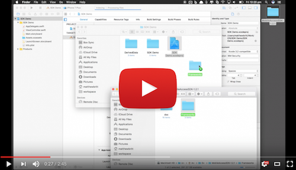

# Configuring your environment

## Xcode setup (Objective-C)

[](https://youtu.be/cobIHxXfdrk)

1\. After downloading the SDK, extract the contents to a folder that is easily located.
 
2\. Start Xcode and create a new Objective-C project.

3\. Open the folder where the SDK was extracted in step 1.  Copy the `Framework` folder to the folder where you created the Xcode project in step 2. 
>The `Framework` folder should be at the same folder level as the .xcodeproj file and should contain `CommonCrypto` and `IBMMobileKit.framework`.

4\. In Xcode, select the top level Project item on the left.  Select the project in the `TARGETS` section.

5\. Select the `General` tab along the top of the middle pane.  Scroll down to the section `Embedded Binaries` and click the **+**.   Click on `Add Other...` and navigate to the `Framework` folder that was copied to your project folder in step 3. Select the `IBMMobileKit.framework`, then click `Open`.

6\. Click `Finish`.

7\. Click on the `Build Settings` tab along the top of the middle pane.

8\. In the search field, type `Always Embed Swift Standard Libraries` and select `Yes`.

9\. Open `ViewController.h` and add the following code snippet:

```objective-c
#import <IBMMobileKit/IBMMobileKit-Swift.h>
#import <AVFoundation/AVFoundation.h>
#import <LocalAuthentication/LocalAuthentication.h>
```
>You should notice the autocomplete working in `ViewController.m` indicating the SDK has been imported correctly.


## Xcode setup (Swift)

[](https://youtu.be/1HdSfuJLXBk)


1\. After downloading the SDK, extract the contents to a folder that is easily located.
 
2\. Start Xcode and create a new Swift project.

3\. Open the folder where the SDK was extracted in step 1.  Copy the `Framework` folder to the folder where you created the Xcode project in step 2. 
>The `Framework` folder should be at the same folder level as the .xcodeproj file and should contain `CommonCrypto` and `IBMMobileKit.framework`.

4\. In Xcode, select the top level Project item on the left.  Select the project in the `TARGETS` section.

5\. Select the `General` tab along the top of the middle pane.  Scroll down to the section `Embedded Binaries` and click the **+**.   Click on `Add Other...` and navigate to the `Framework` folder that was copied to your project folder in step 3. Select the `IBMMobileKit.framework`, then click `Open`.

6\. Click `Finish`.

7\. Click on the `Build Settings` tab along the top of the middle pane.

8\. In the search field, type `Import Paths` and enter `Framework/CommonCrypto`.

9\. Open `ViewController.swift` and add the following code snippet:

```swift
import IBMMobileKit
import LocalAuthentication
import AVFoundation
```
>You should notice the autocomplete working, the SDK has been imported correctly.
